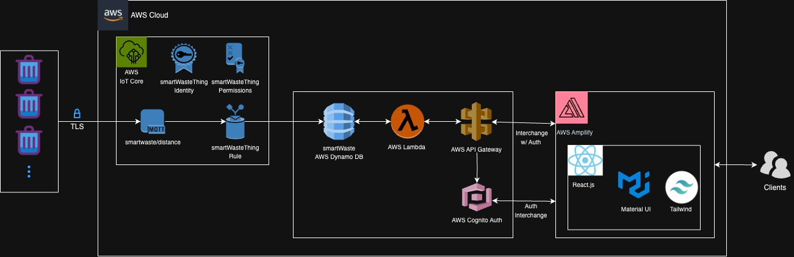
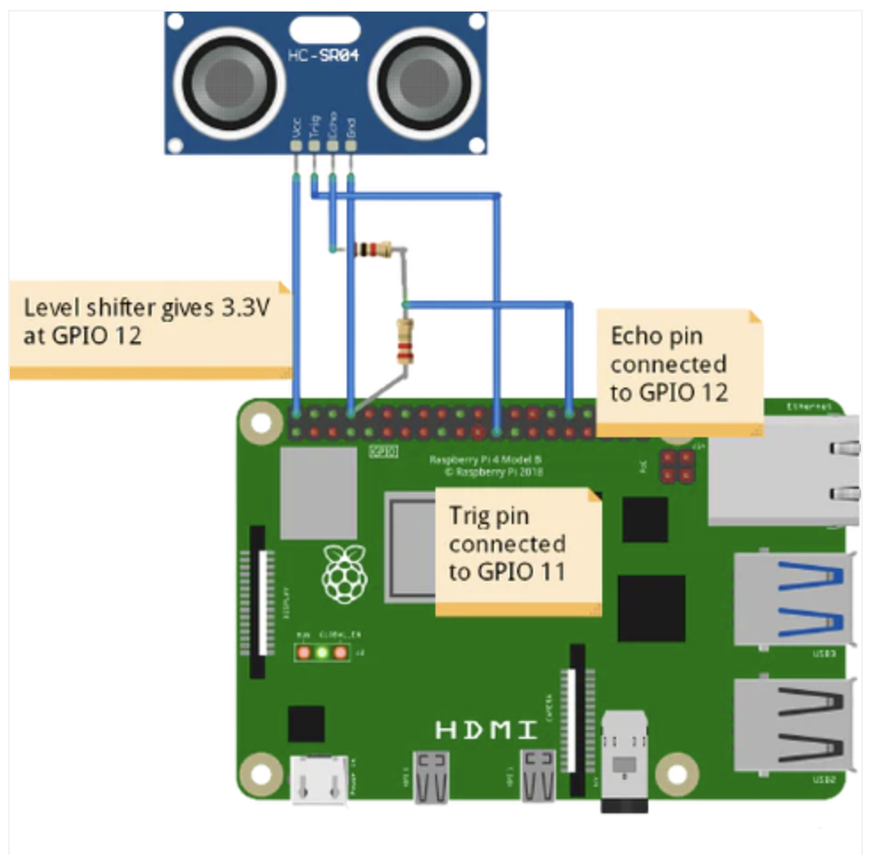
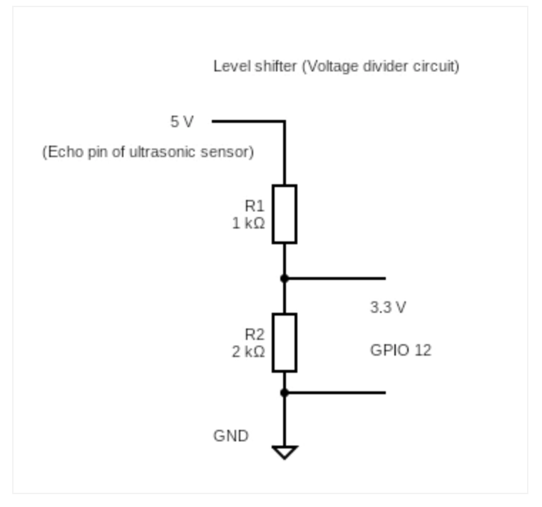
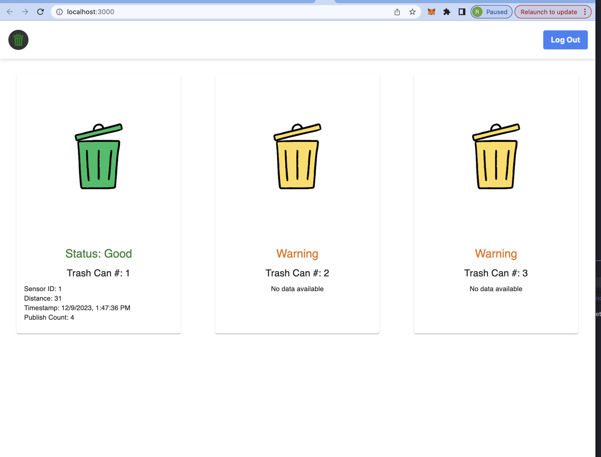

# Smart-Waste Monorepo

### Problem 
There are 4 main problems we are tackling:

1. Inconsistent Monitoring: Reliance on visual checks or routine schedules for emptying trash cans can lead to both premature or delayed disposal actions. Since trash cans can be full or empty depending on the usage, there is no direct schedule that can take place to ensure the most efficient waste management.

2. Overflow and Spillage: Without a knowledge of the waste levels in trash cans, the issue of litter spillage is quite alarming. Many trash cans at UC Santa Barbara have this problem. This can lead to attracting pests, unsanitary and unsightly conditions.

3. Poor Operational Efficiency: Real-time data allows for better planning and allocations of cleaning staff. This allows overall operational efficiency and reduces waste management costs. By accurately gauging waste levels, cleaning staff can efficiently schedule trash collection, avoiding the inefficiencies of too early or too late trash pickups.

4. Lack of Access to Data-Driven Insights: Collection of fill-level data over time can provide valuable insights into waste generation patterns, assisting in better resource allocation and environmental sustainability efforts. For example, the UCSB library tends to have frequent trash buildups at certain hotspots. This data enables the strategic placement of additional trash cans in areas demonstrating higher waste generations.

### Vision
Our vision is centered around revolutionizing waste management systems. We're initiating this transformative journey by equipping trash and recycling containers with advanced sensors and connectivity features. This forward-thinking approach aims to establish a comprehensive network capable of delivering real-time information regarding the fill status of bins, tailored specifically for institutional entities such as governments, educational institutions, and corporate enterprises.

The core objective of this initiative is to significantly enhance the efficiency of waste collection processes. By harnessing the power of real-time data, we can optimize hauling routes, thereby substantially reducing emissions associated with waste transportation. This not only contributes to environmental sustainability but also aligns with broader eco-friendly goals.

Moreover, the valuable data collected through this system will serve as a crucial tool in providing deeper insights. These insights will be instrumental in formulating and implementing strategies focused on waste reduction and promoting initiatives that align with the aspirations of achieving zero waste targets.

A key attribute of our technology is its exceptional scalability. This scalability is largely attributed to its design, which allows for seamless integration with existing waste management infrastructures. Such integration ensures that our solution can be easily adopted and adapted across various scales and settings, making it a versatile starting point and practical choice for enhancing waste management systems.

# Diagrams 

### High Level Software Architecture

### High Level Hardware Architecture

### Voltage Diagram

### Frontend 

# Quick Use 

### Starting Ultra Sonic Sensor for the Trash Can(s)
- ssh briggsrrr@briggsrrr.local
- ./SmartWaste/iot-things/ultrasonic/start.sh SENSORID/ALL

### Starting Camera Sensor for the Trash Can(s) NOTE:INCOMPLETE
- ssh briggsrrr@briggsrrr.local
- ./SmartWaste/iot-things/camera/start.sh SENSORID/ALL

### Starting Frontend
- cd amplify-frontend/
- npm start

### Starting Message Service NOTE:INCOMPLETE
- cd message-service/
- uvicorn main:app --reload

# Links

|     Link for     | Link                              | 
|:-------------------|:----------------------------------|
|Weekly Meeting Notes| [link](https://docs.google.com/document/d/1GXyXUnTMKGIcYvyj-8aEd7spdDEeYQJQScLqdhkhCxc/edit?usp=sharing)   |
|Vision              | [link](https://docs.google.com/document/d/19BQFE9qavzx0fWWvS-5EhH40ZsDCvB0uqDrFN7ACtwo/edit?usp=sharing)   |
|Video               | [link](https://drive.google.com/file/d/1h9XxrRvQ2e1K4mKpK2Q16ccHG5-gYqTM/view?usp=drive_link)   |
|Demo/Slides         | [link](https://docs.google.com/presentation/d/12mB6Wt0_9NVAGVgqEKEsMamqNH9BfbzvOCWJjXsjpRA/edit?usp=sharing)   |

